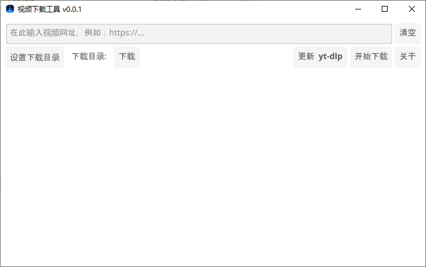

# yt-dlp-simpgo

[](https://github.com/Yinr/yt-dlp-simpgo/actions/workflows/release.yml)
[](https://github.com/Yinr/yt-dlp-simpgo/releases/latest)

一个基于 [yt-dlp](https://github.com/yt-dlp/yt-dlp) 的简单图形界面下载工具。  
为那些想要通过图形界面使用 yt-dlp 功能的用户提供了便捷的操作方式，特别适合不熟悉命令行操作的普通用户。



## 项目简介

yt-dlp-simpgo 是 yt-dlp 的图形前端，通过简洁直观的用户界面封装了 yt-dlp 强大的视频下载功能。项目旨在为希望使用 yt-dlp 但又不希望通过命令行进行操作的用户提供一个简单易用的解决方案。

## 功能特性

- 图形界面操作，简单易用
- 自动下载和更新 yt-dlp
- 启动时自动检测 yt-dlp 新版本
- 支持设置下载目录
- 支持配置网络代理
- 支持字幕、章节、元数据等选项
- Windows 版本内置 exe 文件图标
- 跨平台支持 (Windows/Linux/macOS)

## 安装

### 下载预编译版本

从 [Releases](https://github.com/Yinr/yt-dlp-simpgo/releases) 页面下载适合您系统的版本。

### 从源码构建

```bash
# 克隆项目
git clone https://github.com/Yinr/yt-dlp-simpgo.git
cd yt-dlp-simpgo

# 构建（输出到 dist/ 目录）
make build

# Windows GUI 版本
make build-gui
```

## 使用方法

1. 运行程序
2. 在输入框中粘贴视频链接
3. 点击"开始下载"按钮
4. 等待下载完成

如果同目录下没有 `yt-dlp` / `yt-dlp.exe`，程序会提示下载；启动时会自动检测 yt-dlp 是否有新版本。

## 配置

程序会在同目录下生成以下配置文件：

- `yt-dlp-simpgo.ini` - 程序配置文件
- `yt-dlp.conf` - yt-dlp 配置文件

可以通过设置界面修改下载目录、代理、字幕、章节、元数据和额外参数。程序下载时会显式使用同目录下的 `yt-dlp.conf`。

## 开发

### 依赖要求

- Go 1.25+
- Fyne GUI toolkit (https://fyne.io/)

### 构建命令

```bash
# 构建当前平台版本 → dist/
make build

# 构建 Windows GUI 版本 → dist/
make build-gui

# 构建所有平台版本 → dist/
make release

# 清理 dist/
make clean

# 清理运行时文件（配置、下载目录、yt-dlp）
make clean-runtime

# 清理构建产物和运行时文件
make clean-all

# 显示帮助信息
make help
```

## 许可证

[MIT](LICENSE)

## 鸣谢

- [yt-dlp](https://github.com/yt-dlp/yt-dlp) - 强大的视频下载工具
- [Fyne](https://fyne.io/) - Go语言跨平台GUI工具包
